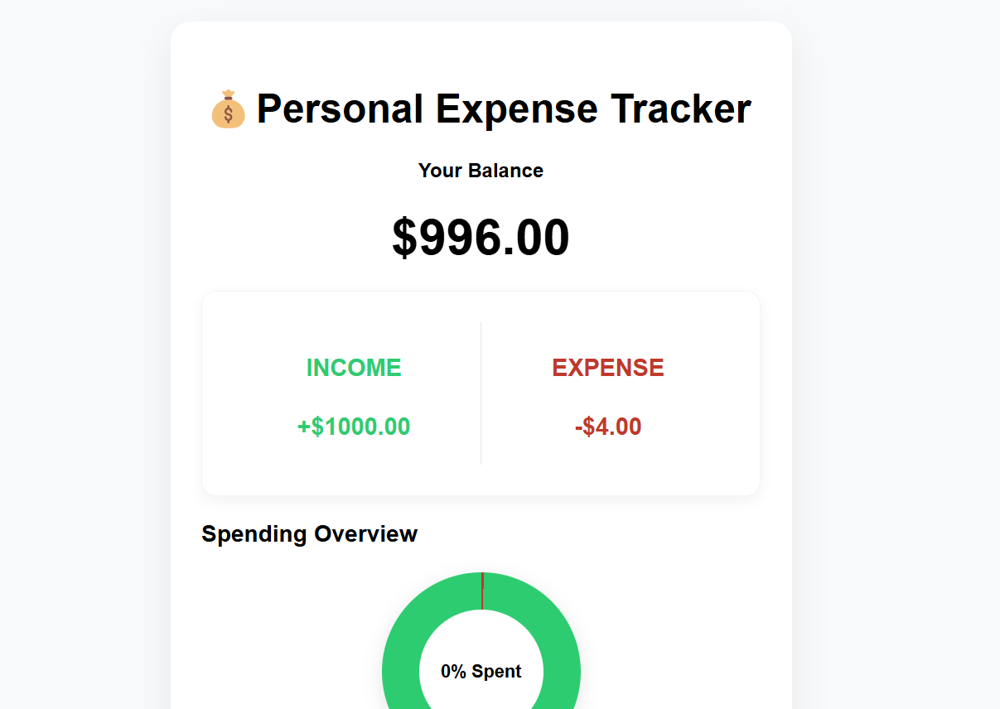
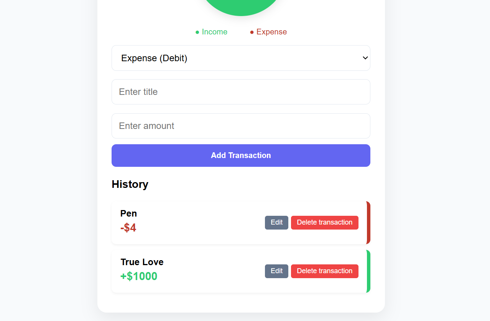

# 💸 Expense Tracker (MERN Monorepo)

A professional full-stack financial management application. This project provides users with a clear visual representation of their income and expenses, helping them make informed financial decisions.

## 🎯 Problems It Solves
* **Financial Blindness:** Users often lose track of small daily spends. This app provides a centralized place to log every transaction.
* **Manual Math Errors:** Automates the calculation of total balance, total income, and total expenses, removing the risk of human error.
* **Lack of Data Persistence:** Unlike physical notebooks, this cloud-synced solution ensures your data is safe and accessible from any device.

## 🚀 Key Functions
* **Full CRUD Operations:** Add, view, edit, and delete transactions with instant UI updates.
* **Real-time Balance Tracking:** Dynamic calculation of the user's current standing based on transaction history.
* **Monorepo Management:** Single-command development environment for both client and server using `concurrently`.
* **State Management:** Efficient data handling on the frontend to ensure a smooth, "no-refresh" experience.

## ScreenShots
| Screenshot 1 | Screenshot 2 | Screenshot 3 |
| :---: | :---: | :---: |
|  |  |  |

<!-- -->

## 🧠 Challenges Faced
* **CORS & Cross-Origin Security:** Solving the "Access-Control-Allow-Origin" error when connecting a Vercel-hosted frontend to a Render-hosted backend.
* **Monorepo Migration:** Cleaning up "Ghost" Git submodules (the arrow folders) to ensure GitHub recognized the project as a single repository.
* **Deployment Syncing:** Configuring **Root Directories** on both Vercel and Render to ensure they looked into the correct sub-folders (`/client` and `/server`).
* **Environment Configuration:** Managing hidden `.env` variables across different environments to keep MongoDB credentials secure.

## 🛠️ Tech Stack

## 📡 API Documentation
| Method | Endpoint | Description |
| :--- | :--- | :--- |
| **GET** | `/expenses` | Retrieve all transactions from the database |
| **POST** | `/expenses` | Add a new transaction (title, amount) |
| **PUT** | `/expenses/:id` | Update an existing transaction |
| **DELETE** | `/expenses/:id` | Remove a transaction permanently |

## ⚙️ Environment Variables
To run this project locally, create a `.env` file in the `expenseTracker_server` folder with the following:
* `MONGO_URI` = Your MongoDB Atlas Connection String
* `PORT` = 8000

## 📁 Project Structure
* `/expenseTracker_client`: Vite + React frontend
* `/expenseTracker_server`: Node.js + Express backend
* `package.json`: Root controller for the monorepo

---
*Created as part of the Web Dev Journey 2026*